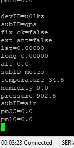

# Arduino Based UniSat data provider to PSoTT (unino)

```c++
/*
_    _       _ _   _
| |  | |     (_) \ | |
| |  | |_ __  _|  \| | ___
| |  | | '_ \| | . ` |/ _ \
| |__| | | | | | |\  | (_) |
 \____/|_| |_|_|_| \_|\___/

An example of feeding data into the PSoTT protocol.
Used Devices:
  - Arduino Uno
  - SDS011
  - HDC1080
  - LPS22 (Can be also LPS25)
 */
```

[PSoTT Standards](https://azat.cc/2022/08/17/telemetry-over-terminal-socket-based-data-publishing-and-subscription-protocol-(psott).html)

Sample :

```
\r\n
devID=<string>
subID=<string>
temperature=<string>
humidity=<string>
...
subID=<string>
something=<string>
\r\n
```

Program Result (unino):


Program Result (UniSat Satellite STM32):



